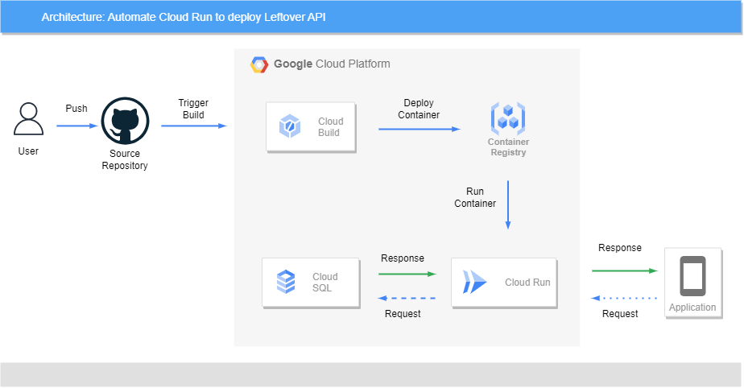

# bangkit-capstone-project API Documentation

This repository contains the documentation for [Leftover](https://flask-app-vqs2yvkkxa-uc.a.run.app/) API.

## 1. Overview

   Millions of tons of food wasted yearly caused by excessively stocked supplies that quickly becomes non-edible 
that has to be thrown away. Here we see an opportunity of using ML as a key in supply chain.
    Leftover is application that trying to tackle this problem by obtaining Restaurant forecasting of the right 
amount of food they have to be served and help restaurant to optimize their inventory, 
thereby lowering operational costs and help maximize profits.

## Cloud Computing Documentation



- ### 1. Creating Flask App to load model from Machine Learning
  - save model and dataset for Machine learning in same directory as `api.py`
  - Load the model in `api.py`
  - create endpoint and test model by running flask using `python api.py` to run it locally and getting predicted data using local ip.
- ### 2. creating Login and Register with Authentication in flask
  - Creating simple Login and Register using dummy database
  - create Json Web Token(JWT) to authenticate login and register
  - create JWT requirement to request prediction
  - change dummy database to cloud sql database
  - Test database to user login and register
  - Test authentication JWT using POSTMAN
- ### 3. Google Cloud Deployment
  - create Dockerfile and requirement.txt to store depedency and place it in root directory
  - clone flask repository `https://github.com/Alboneh/flask-main.git` in cloud shell
  - run this command to build container and push it to container registry
      ```
    docker build -t flask-app:v1 .
    docker tag flask-app:v1 gcr.io/western-beanbag-351610/flask-app:v1
    docker push gcr.io/western-beanbag-351610/flask-app:v1
    ```
  - Enable Cloud Run
  - select flask-app image container and deploy to cloud run 
- ### 3. ci/cd pipeline with Cloud Build
  - Enable Cloud Build
  - create cloudbuild.yaml and write command to build new docker container,push it to container registry and run it everytime it trigger
  - open CloudBuild and select repository and cloudbuild.yaml as config
  - select trigger to everytime push happen in main branch
  - build cloudbuild trigger
  - add permission to cloudbuild service acccount and run the trigger to automate deployment 

## 3. Resource
All resource/route that Leftover APi use have been documented using Swagger UI in:
https://flask-app-vqs2yvkkxa-uc.a.run.app/doc

## 4. Deployment
Leftover APi is deployed using google cloud run that use cloud build as ci/cd pipeline that connected to this main repository
	
